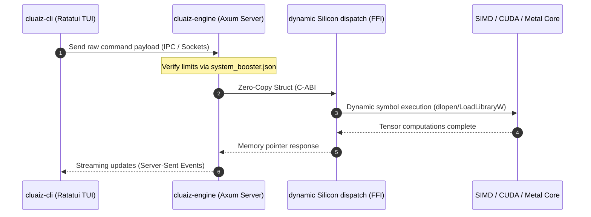

# Welcome to cluaiz Documentation

Welcome to the official documentation portal for `cluaiz`—a decoupled, local AI inference engine and orchestrator engineered to execute neural models directly on physical edge workstations.

---

## 🚀 Native Workstation Bootstrapping

Deploy `cluaiz` directly onto your hardware workspace without virtualized containers or external Python environment runtime requirements.

### Windows (PowerShell)
```powershell
powershell -ExecutionPolicy Bypass -Command "irm https://cluaiz.com/install.ps1 | iex"
```

### Linux & macOS (Bash)
```bash
curl -fsSL https://cluaiz.com/install.sh | bash
```

---

## 🏛️ Edge Topology & Execution Lifecycle

`cluaiz` uses a split client-daemon model to isolate front-end user experience rendering from raw tensor FFI execution pipelines.



---

## 🗺️ Documentation Directory (Diátaxis Structure)

Navigate through the system specifications based on your development targets:

### 📖 1. Tutorials (Learning Pathways)
*   **[Introduction to cluaiz](/docs/get-started/introduction)** — Core system philosophy, decoupled layers, and privacy-preserving sandboxes.
*   **[Quickstart Guide](/docs/get-started/quickstart)** — Step-by-step native bootstrapping guide and manual from-source compilation setups.

### 🛠️ 2. How-To Guides (Deployment & Operations)
*   **[System Architecture Overview](/docs/get-started/architecture)** — Network socket configurations, thread boundaries, and workstation initialization limits.
*   **[Hardware Troubleshooting](/docs/architecture/hardware-troubleshooting)** — Diagnose driver binding errors, VRAM depletion, and compile-time target overrides.


### ⚙️ 3. Reference Manuals (Configuration & API Contracts)
*   **[Configuration Registry Index](/docs/reference/engine-configuration)** — Parameters for [system_booster.json](/docs/reference/engine-configuration#2-compute-acceleration--optimization-profile-system_boosterjson), [Permission.json](/docs/reference/engine-configuration#3-security-boundaries--capability-rules-profile-permissionjson), and [system_control.json](/docs/reference/engine-configuration#1-silicon-truth--hardware-governance-profile-system_controljson).
*   **[Terminal CLI Commands Reference](/docs/reference/terminal-commands)** — Comprehensive command arguments, dynamic options, and local workspace hooks.
*   **[HTTP API Interface](/docs/reference/api)** — Complete OpenAPI specification, POST endpoints, and schema declarations for server models.


### 🧠 4. Explanation (Architectural Deep Dives)
*   **[Zero-Latency Unified FFI Bridging](/docs/architecture/unified-brain-ffi)** — C-ABI bindings, zero-copy operations, and runtime CPU/GPU hardware-agnostic dispatch loops.
*   **[CLI Engine Process Design](/docs/architecture/cli-process-design)** — Deeper breakdown of execution threads and backend socket IPC handlers.
*   **[CEL Evaluation & Execution Model](/docs/architecture/cel-ffi-api-execution)** — Logic parsing pipelines, security constraints, and custom script integrations.


