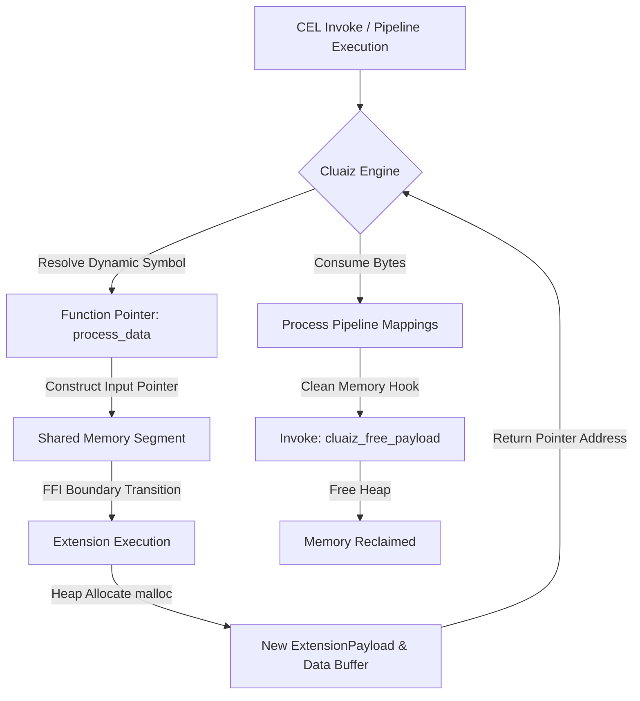

# Cluaiz C-Pointer & FFI Memory Specifications Manual

This manual details the specifications for using raw C-pointers and FFI zero-copy memory transfers within the Cluaiz Inference Engine. It covers memory representations, lifetime conventions, allocation mechanics, and SDK bindings for dynamic execution.

---

## 🏛️ 1. Core Architecture: FFI Pointer Bridge

To prevent memory copies, the Cluaiz Engine passes binary payloads directly across language boundaries using standard **C Application Binary Interface (C-ABI)** structures. 

Instead of serialization over HTTP/TCP ports, host applications dynamically invoke engine execution parameters directly in memory using shared buffer pointers.

### A. Memory Representation (`ExtensionPayload`)
The core pointer struct is defined strictly under the C-ABI layout. It binds a payload type identifier, a memory pointer address, and a length segment to guarantee stable memory alignment.

```c
typedef enum {
    Json = 0,
    Cdql = 1,
    WasmBinary = 2,
    RawBytes = 3,
    Bincode = 4
} PayloadType;

typedef struct {
    PayloadType payload_type;
    const uint8_t* data_ptr;
    size_t data_len;
} ExtensionPayload;
```

---

## 🔒 2. Memory Lifetime & Allocation Rules

When handling C-pointers across language boundaries (FFI), explicit allocations and deallocations are mandatory to avoid double-free panics or memory leaks:

1. **Input Payloads**: When the Engine passes an `ExtensionPayload` pointer to an extension, the host Engine retains ownership. The extension must *never* free or write to the input payload's buffer.
2. **Output Payloads**: When an extension returns a pointer, it must allocate both the `ExtensionPayload` envelope and its underlying buffer using dynamic heap allocations (`malloc` or equivalent).
3. **Deallocation Hook**: The Engine assumes ownership of the returned pointer. Once the Engine consumes the data, it triggers the library's exported deallocation hook to reclaim memory from the system heap:
   ```c
   void cluaiz_free_payload(ExtensionPayload* ptr);
   ```

---

## ⚙️ 3. Execution Pipeline Flow

The zero-copy dynamic linking cycle operates under the following sequence:




---

## 🌐 4. Cross-Language SDK Mappings

Below is the compilation reference matrix mapping pointer bindings across target languages:

### A. C/C++ FFI SDK
- Allocations must use pure `malloc` / `free` boundary calls. Expose functions under `extern "C"` to prevent C++ symbol name mangling.
- Reference Manuals: [C FFI SDK Guide](../cel/sdk/c-ffi.md) and [C++ FFI SDK Guide](../cel/sdk/cpp-ffi.md).

### B. Go (cgo) SDK
- Maps C-pointers to Go byte slices using `C.GoBytes(unsafe.Pointer(input.data_ptr), C.int(input.data_len))`.
- Since Go's garbage collector ignores memory allocated via `C.malloc`, explicit `cluaiz_free_payload` implementation is mandatory.
- Reference Manual: [Go FFI SDK Guide](../cel/sdk/go-ffi.md).

### C. Python (cffi) SDK
- Integrates ctypes pointers using `ctypes.POINTER(ctypes.c_uint8)`.
- Reference Manual: [Python CFFI SDK Guide](../cel/sdk/python-cffi.md).

### D. Node.js FFI SDK
- Shares buffers directly with JS `Buffer` arrays without Base64 conversions, mapping parameters using `node-ffi-napi`.
- Reference Manual: [NodeJS FFI SDK Guide](../cel/sdk/nodejs-ffi.md).

### E. Rust Native SDK
- Interfaces directly with Rust native crates (`ExtensionPayload` with `#[repr(C)]`).
- Reference Manual: [Rust Native SDK Guide](../cel/sdk/rust-native.md).

---

## 🛡️ 5. JIT & WASM Sandbox Pointer Barriers

To secure raw memory pointer operations, the engine implements strict sandbox limits:
* **JIT Context Injection**: The JIT pipeline injects context directly into attention pointer segments, requiring strict permission checks. Refer to the [JIT Architecture Manual](../engine/jit_architecture.md) and [Permission Manual](../engine/permission.md).
* **WASM Instruction Fuel Limits**: Before passing a pointer into a WebAssembly module, the Cluaiz Engine isolates memory structures using WASM memory barriers. Refer to the [WASM Security Matrix](../cel/authoring/wasm_vs_rhai_vs_pure.md).

