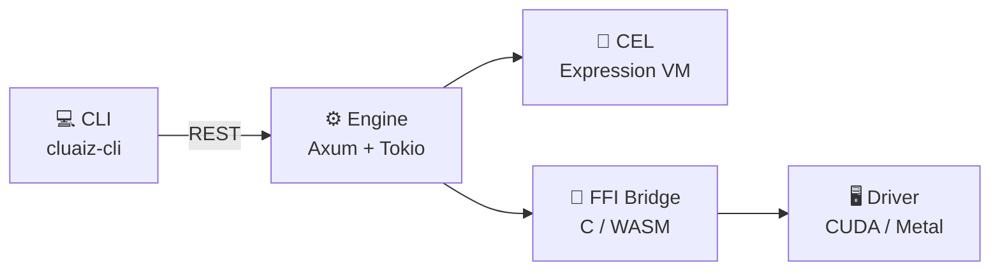

# Master Reference Index

Complete reference index for the cluaiz engine — all specifications, APIs, CLI contracts, and configuration profiles in one place.

---

## 📚 Reference Sections

### Reference Index
Core language and system specifications:
* **[CEL Manual](../reference/cluaiz-expression-language)** — Cluaiz Execution Language master reference.
* **[C-Pointer Specifications](../reference/c-pointer-fii)** — FFI boundary contracts and memory layout rules.
* **[System Dictionary](../reference/dictionary)** — Global type registry and term definitions.

### CLI Reference
* **[Core CLI Manual](../reference/terminal-commands)** — Full command argument reference and shell integration.

### HTTP API Reference
* **[Unified API Reference](../reference/api)** — REST endpoint contracts, request/response schemas, and error codes.

### Configuration Profiles
* **[Engine Configurations](../reference/engine-configuration)** — `system_booster.json` and `system_control.json` field-level specs.

---

## 🗺️ Architecture Quick Reference

---

## 📋 Document Status

| Document | Status | Path |
|---|---|---|
| CEL Manual | ✅ Complete | `docs/reference/cluaiz-expression-language.md` |
| C-Pointer FFI | ✅ Complete | `docs/reference/c-pointer-fii.md` |
| System Dictionary | ✅ Complete | `docs/reference/dictionary.md` |
| CLI Manual | ✅ Complete | `docs/reference/terminal-commands.md` |
| API Reference | ✅ Complete | `docs/reference/api.md` |
| Engine Config | ✅ Complete | `docs/reference/engine-configuration.md` |
