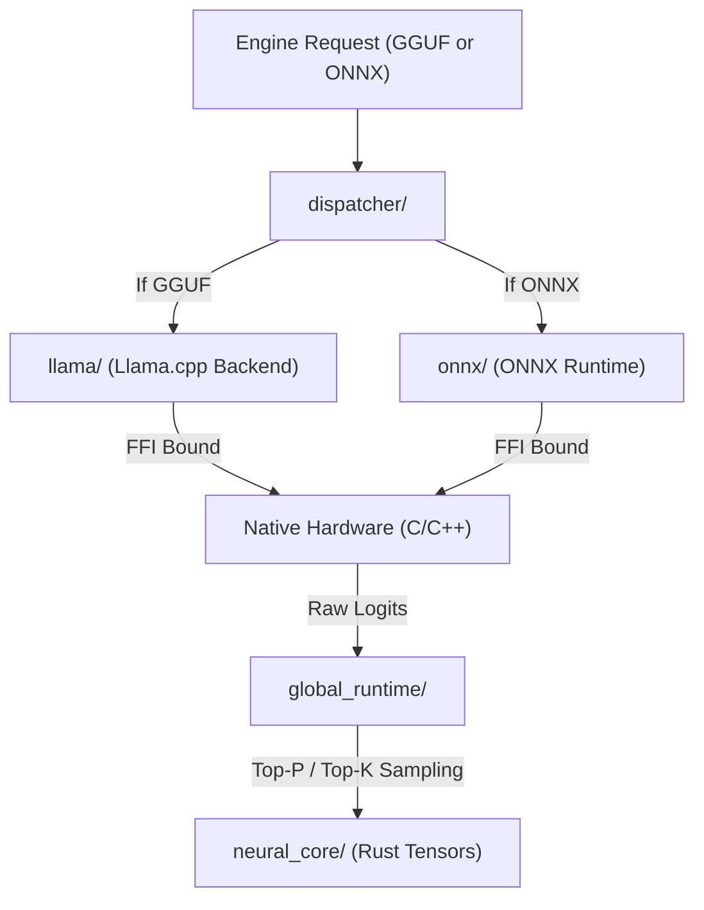

# 🧩 Interface Engines Subsystem (`interface-engines/`)

<strong>The Native Backend Execution Substrate</strong>

---

## 🎯 Deep Purpose

The `interface-engines` workspace is the dedicated native execution tier of the cluaiz Inference ecosystem. While the outer `inference-engine` crate handles HTTP REST requests, telemetry, models downloading, and the LMDB memory caches, this subsystem strictly handles the raw mathematical matrix multiplications required to generate text.

By separating the native backends (`llama.cpp`, `onnxruntime`) into this isolated subsystem, we ensure that a `SIGSEGV` crash in a C++ math kernel does not bring down the entire Tokio web server.

## 🏛️ Architectural Flow

## 🧬 Subsystems Overview (The True Source Tree)

> **Note:** The architecture has evolved. Legacy engines like `candle` have been removed in favor of a strictly defined GGUF/ONNX dual-backend system.

### 1. `dispatcher/`
- **The Core Logic:** The central router. Reads the model manifest format and dynamically routes the execution to either the `llama` or `onnx` crate.
- **The "Why":** Provides a unified execution trait so the outer web server never needs to know *how* the math is being executed.

### 2. `ffi/`
- **The Core Logic:** The global C-ABI boundary for external callers (like Desktop apps) that want to bypass the outer Axum HTTP server and call the native math engines directly.

### 3. `global_runtime/`
- **The Core Logic:** Cross-backend supervisor. It manages unified thread pools and identical token sampling (Temperature, Top-K) regardless of which native backend generated the logits.

### 4. `llama/`
- **The Core Logic:** The GGUF execution engine. Binds to `llama.cpp` using raw `extern "C"` blocks (`ffi/`) while protecting the outer rust application with safe Resource Acquisition Is Initialization (RAII) wrappers (`native/`).
- **The "Why":** Native, zero-overhead execution of the world's most popular edge AI format.

### 5. `onnx/`
- **The Core Logic:** The ONNX Runtime execution engine. 
- **The "Why":** For executing specialized embedding and vision models that are highly optimized by Microsoft's ONNX graph compilers.

### 6. `neural_core/`
- **The Core Logic:** Defines the mathematically pure Rust definitions of "Tensors" and "KV Caches".
- **The "Why":** Forces both the `llama` and `onnx` crates to return their results in exactly the same memory format, ensuring cross-compatibility.

### 7. `utils/`
- **The Core Logic:** Stateless helpers for memory offset calculations and bitwise arithmetic used by the math backends.