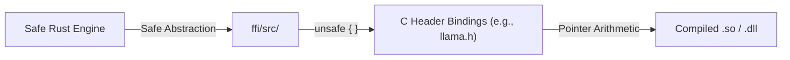

# 🌉 Foreign Function Interface (`interface-engines/ffi/`)

<strong>Secure C/C++ Memory Boundaries</strong>

---

## 🎯 Deep Purpose

The `ffi/` (Foreign Function Interface) crate is the physical bridge between the memory-safe Rust world and the memory-unsafe C/C++ world. The core tensor math required for Large Language Models is written in highly optimized C++ (e.g., `llama.cpp` and `onnxruntime`). 

Calling these libraries directly from Rust is extremely dangerous. A buffer overflow or a dangling pointer in the C++ layer will cause a `SIGSEGV` (Segmentation Fault) that instantly crashes the entire cluaiz Engine. This module wraps those unsafe calls in strict Rust memory boundaries to prevent systemic crashes.

## 🏛️ Architectural Mechanics

## 🧬 Significant Details

### 1. The `unsafe` Wrapper Boundary
- **The Core Logic:** Isolates all `unsafe` Rust blocks into a single module. It takes safe Rust structures (like `Vec<u8>`), converts them into raw C-pointers (`*mut c_void`), and passes them across the ABI (Application Binary Interface) boundary.
- **The "Why":** Debugging memory corruption in a multi-threaded web server is nearly impossible. By strictly confining all raw pointer manipulation to the `ffi/` crate, engineers know exactly where to look if a memory leak or crash occurs. It guarantees that the rest of the engine remains provably memory-safe.
