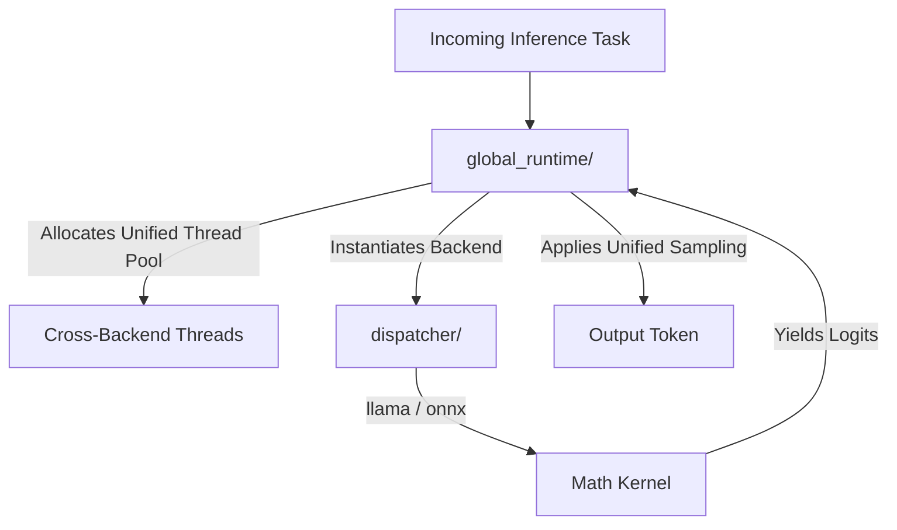

# 🌐 Global Runtime (`interface-engines/global_runtime/`)

<strong>The Cross-Backend Execution Supervisor</strong>

---

## 🎯 Deep Purpose

The `global_runtime` crate is the overarching execution supervisor for the `interface-engines` subsystem. While individual backends (like `llama` or `onnx`) handle the raw mathematical execution, the Global Runtime manages the lifecycle of the entire inference session. It governs the unified thread pools, memory arenas, and the active token streaming queue that spans across any selected backend.

## 🏛️ Architectural Mechanics

## 🧬 Significant Details
- **The Core Logic:** Maintains the universal runtime loops. Instead of writing a token sampling loop for `llama` and a separate one for `onnx`, the `global_runtime` pulls raw logits from either backend and applies universal Top-K / Top-P sampling.
- **The "Why":** Prevents code duplication. It ensures that no matter what math backend is currently executing, the engine guarantees identical safety checks, telemetry polling, and token generation behavior.
