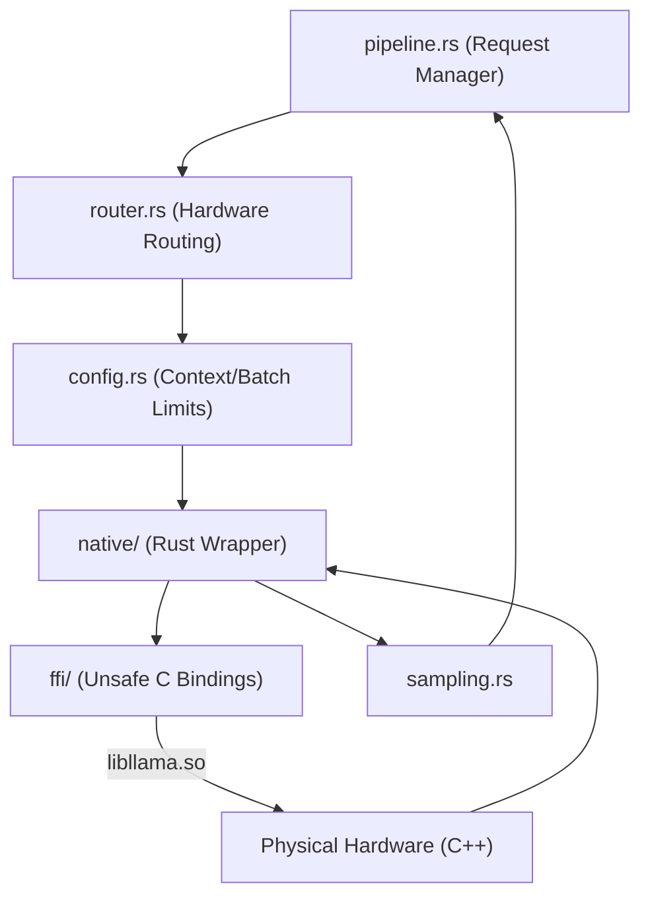

# 🦙 Llama Execution Source (`interface-engines/llama/src/`)

<strong>The GGUF Native Execution Router</strong>

---

## 🎯 Deep Purpose

The `llama/src/` directory is the master source tree for executing heavily quantized `.gguf` language models. It takes the abstract execution commands from the `dispatcher` and maps them down into native execution pipelines.

Unlike standard API wrappers that just spawn a child process, this module links directly into compiled C/C++ memory. It governs how the physical GPU layers are partitioned, how KV memory is mapped, and how inline assembly kernels (`asm_kernels.rs`) accelerate processing on constrained CPUs.

## 🏛️ Architectural Flow

## 🧬 Significant Directories & Files

### 1. `asm_kernels.rs` & `hybrid.rs`
- **The Core Logic:** Directly embeds or links to platform-specific assembly instructions (like AVX2/AVX-512) for custom matrix multiplications that bypass standard C++ loops.
- **The "Why":** Standard `llama.cpp` is fast, but cluaiz injects custom hybrid execution strategies to eke out 10-15% more Tokens-Per-Second (TPS) on older Intel/AMD processors.

### 2. `pipeline.rs` & `router.rs`
- **The Core Logic:** Organizes incoming requests into batches and routes them to the correct hardware (CPU vs GPU).
- **The "Why":** If multiple API requests hit the engine simultaneously, `pipeline.rs` ensures they are batched together into a single C++ execution pass, dramatically improving parallel throughput.

### 3. `ffi/`
- **The Core Logic:** The raw, memory-unsafe bindings to the compiled C++ library.

### 4. `native/`
- **The Core Logic:** The safe Rust abstraction layer that manages the lifecycle, memory freeing, and context mapping over the `ffi/` bindings.
