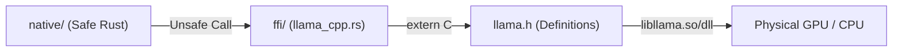

# 🌉 Native C++ Bindings (`interface-engines/llama/src/ffi/`)

<strong>The Unsafe Memory Boundary</strong>

---

## 🎯 Deep Purpose

The `ffi/` module is the strict boundary between the memory-safe Rust execution pipeline and the unsafe, highly optimized `llama.cpp` C-library. 

Because `llama.cpp` manually manages heap allocations (`malloc`, `free`) for tensor matrices and KV caches, calling it directly from Rust is extremely dangerous. This module defines the exact C-ABI (Application Binary Interface) structs and function pointers required to bridge the two languages.

## 🏛️ Architectural Mechanics

## 🧬 Significant Files

### 1. `llama_cpp.rs`
- **The Core Logic:** Contains the literal `extern "C"` blocks mirroring the functions exposed by `llama.h` (e.g., `llama_new_context_with_model`, `llama_decode`).
- **The "Why":** Rust cannot naturally read C++ headers. This file manually re-declares the C structures (like `llama_token_data_array`) so the Rust compiler knows exactly how many bytes to allocate when passing arrays across the language boundary.

### 2. `lucebox.rs`
- **The Core Logic:** Defines specialized FFI bridges for the internal cluaiz "Lucebox" telemetry and execution modifications.
- **The "Why":** We don't just use vanilla `llama.cpp`. cluaiz injects custom telemetry and diagnostic probes into the C++ runtime. This file handles the unsafe pointers required to extract those custom metrics back into Rust space.
