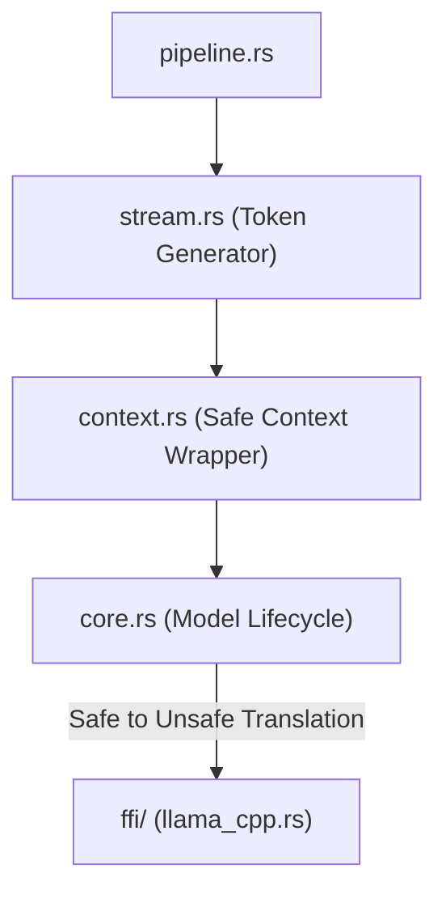

# 🛡️ Safe Native Abstractions (`interface-engines/llama/src/native/`)

<strong>Memory-Safe Rust Wrappers for C++ Tensors</strong>

---

## 🎯 Deep Purpose

While the `ffi/` directory contains raw, unsafe pointers to C++ memory, it is illegal for the rest of the cluaiz Engine to use those pointers directly. The `native/` module encapsulates those raw C-pointers inside safe, automatically managed Rust structures (implementing `Drop`, `Send`, and `Sync`).

This guarantees that if the Rust engine crashes or aborts a request early, the underlying C++ memory (like a 4GB KV Cache) is correctly freed via RAII (Resource Acquisition Is Initialization), preventing catastrophic VRAM leaks.

## 🏛️ Architectural Flow

## 🧬 Significant Files

### 1. `core.rs` & `context.rs`
- **The Core Logic:** Wraps the raw `llama_model` and `llama_context` C-pointers. Implements the `Drop` trait to automatically call `llama_free()` when the Rust variable goes out of scope.
- **The "Why":** A multi-threaded web server can drop connections at any time. If a user closes their browser mid-generation, `core.rs` ensures the VRAM allocated for that chat is immediately returned to the OS.

### 2. `stream.rs`
- **The Core Logic:** Manages the active token decoding loop. Extracts the logits from the C++ backend and pushes them through the sampler.
- **The "Why":** Token generation is a blocking loop in C++. This file handles the asynchronous yielding so the Tokio runtime isn't stalled by a single heavy generation task.

### 3. `speculative.rs`
- **The Core Logic:** Implements Lookahead / Speculative Decoding abstractions safely.
- **The "Why":** Passing multiple drafted tokens at once requires complex C-array management. This file ensures the draft arrays passed to the C++ backend never exceed their allocated bounds.

### 4. `sampler.rs`
- **The Core Logic:** A safe wrapper around the `llama.cpp` sampling chain (Temperature, Top-K, Min-P, Repetition Penalties).
