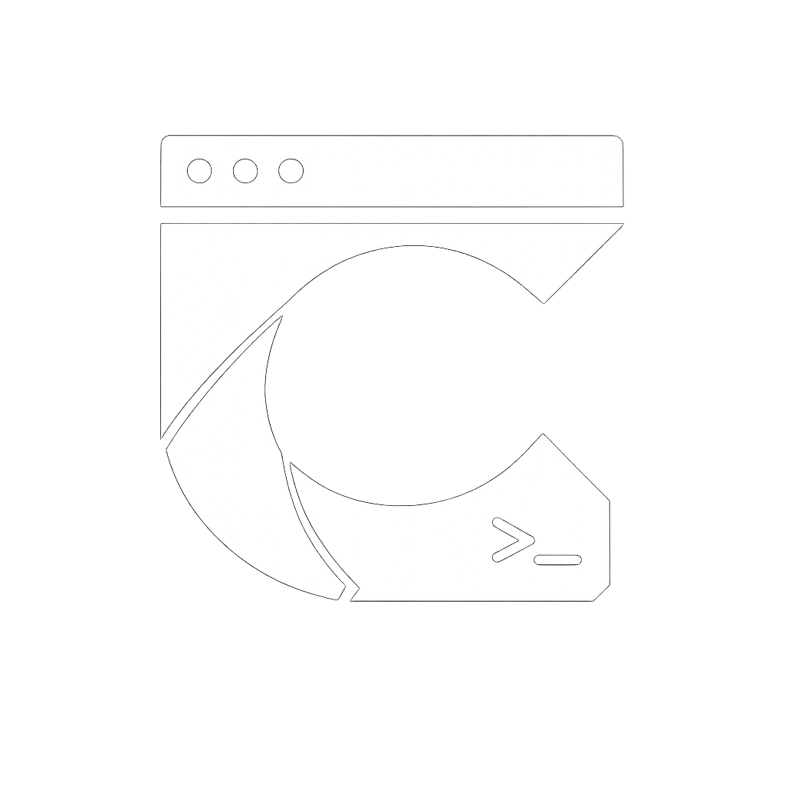
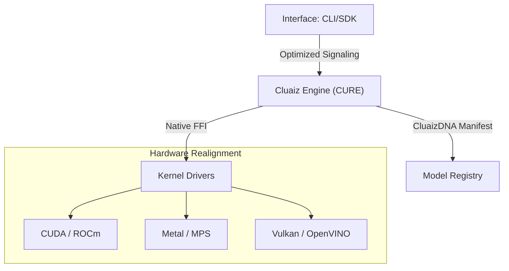

<p align="center">
  
</p>

<h1 align="center">Cluaiz Neural Ecosystem</h1>

<p align="center">
  <b>High-Performance Silicon-Native Inference Infrastructure</b><br>
  <i>Shared-memory optimized signaling | CluaizDNA Modular Architecture | Native Silicon Interface</i>
</p>

<p align="center">
  
  
  
  
</p>

---

## 🛡️ **Project Trust & Current Status**

> [!IMPORTANT]
> **Current Phase**: **Industrial Alpha (Research Phase)**.
> Cluaiz is an experimental neural infrastructure. While the core architecture is build-stable, hardware-constrained guarantees and specialized ternary kernels are undergoing rigorous validation.

### **Current Capabilities**
- ✅ **Shared-Memory Signaling**: Sub-microsecond path for IPC between application and engine.
- ✅ **Modular Handshake**: Dynamic linkage to pre-compiled kernels (Llama, Candle).
- ✅ **Hardware Fingerprinting**: Atomic silicon discovery and profiling.
- ✅ **Cross-Platform Baseline**: Native MSVC/GNU support for Windows and Linux.

### **Research Directions (In Progress)**
- 🧪 **AtmaSteer v2**: Fine-grained structured token masking for 100% schema adherence.
- 🧪 **Ternary Optimizations**: Specialized Addition-Subtraction kernels for BitNet b1.58.
- 🧪 **P2P Universal Sync**: Local context synchronization without cloud dependencies.

---

## 🧭 **What is Cluaiz? (The Infrastructure Layer)**

Cluaiz is a **Silicon-Native Neural Kernel** designed to orchestrate local inference with minimized abstraction overhead. It is **NOT** an AI model, but the orchestrator that speaks the native language of the silicon.

| Component | Role | Implementation |
| :--- | :--- | :--- |
| **Engine** | Orchestrator | Rust-Native Kernel Management |
| **DNA** | Manifest | Unified Identity & Versioning |
| **AtmaSteer** | Steering | Constrained Decoding & Masking |
| **Drivers** | Interface | Native FFI (CUDA, Metal, Vulkan) |

---

## 🏗️ **Design Principles**

- **Minimize Abstraction Overhead**: Bypassing heavy middleware (Docker, Python, Node) for direct silicon access.
- **Modular Runtime**: Decoupled engine and interface layers for heterogeneous hardware compatibility.
- **Hardware-Aware Execution**: Dynamic kernel selection based on real-time silicon fingerprinting.
- **Reproducible Binary Routing**: Ensuring consistent inference results across platforms via CluaizDNA.
- **Cross-Platform Portability**: Native execution across Windows, Linux, and Apple Silicon.

---

## 🧭 **Universal Architecture**

Cluaiz utilizes a tiered stack to bridge the gap between high-level applications and low-level hardware.

### **Neural Runtime Stack**
```text
Application (CLI / SDK)
      ↓ (Shared-Memory Signaling)
Cluaiz Engine (Orchestrator)
      ↓ (Dynamic Native FFI)
Inference Kernels (Llama.cpp / Candle)
      ↓ (Silicon Drivers)
Hardware (CUDA / Metal / Vulkan)
```

### **The CluaizDNA standard**
A decoupled, three-tier modular design that ensures zero-drift between the CLI, the Engine, and the bare-metal Drivers.



---

## 📊 **Hardware & Compatibility Matrix**

### **Silicon Backend Matrix**
| Backend | Vendor | Acceleration | Status |
| :--- | :--- | :--- | :--- |
| **CUDA** | NVIDIA | Tensor Cores (v12+) | ✅ Alpha |
| **Metal** | Apple | MPS / Neural Engine | ✅ Alpha |
| **Vulkan** | Universal | Cross-Vendor Compute | ✅ Alpha |
| **OpenVINO** | Intel | NPU / iGPU | 🧪 Experimental |

### **OS Availability**
| OS | Architecture | Target | Status |
| :--- | :--- | :--- | :--- |
| **Windows** | x86_64 | MSVC Native | ✅ Alpha |
| **Linux** | x86_64 | GNU / Musl | ✅ Alpha |
| **macOS** | ARM64 (M1+) | Mach-O Native | ✅ Alpha |
| **Android** | ARM64 | NDK / Neon | 🧪 Planned |

### **Model Compatibility**
- ✅ **GGUF** (Universal Quantization)
- ✅ **BitNet b1.58** (Ternary Support)
- ✅ **Llama.cpp Kernels**
- ✅ **Candle Backends**

---

## 🛰️ **Routing & Steering**

### **AtmaSteer: Token Masking Protocol**
Enforces structural output (JSON/Schema) through **constrained decoding**. By applying token-level masking during the sampling phase, Cluaiz prevents structural hallucinations at the hardware layer.

### **Dynamic Skill Routing**
Automatically maps neural tasks to specialized kernels based on hardware efficiency profiles, ensuring optimal "Silicon-to-Task" performance.

---

## 📊 **Benchmarking & Comparison**

### **Performance Snapshot**
*Measured on AMD Ryzen 7 7435HS + NVIDIA RTX 4050.*

| Metric | Cluaiz (Alpha) | Standard Middleware |
| :--- | :--- | :--- |
| **Signaling Latency** | **Sub-microsecond** | ~20ms - 50ms |
| **Memory Footprint** | **~25MB** | ~800MB (Docker) |
| **Startup Time** | **~150ms** | ~2.5s - 5s |

### **Cluaiz vs. Legacy Wrappers**
| Feature | **Cluaiz** | **Generic Wrappers** |
| :--- | :--- | :--- |
| **Runtime Routing** | ✅ **Dynamic** | ❌ Fixed |
| **Hardware Probing** | ✅ **Atomic** | ⚠️ Limited |
| **Memory Policy** | ✅ **LRU Arbiter** | ❌ None |
| **Abstraction** | **Native FFI** | HTTP/API Layer |

---

## 🛡️ **Security Architecture**

- **Process Isolation**: Kernels execute in restricted sub-processes with OS-level sandboxing (Job Objects on Windows, Namespaces on Linux).
- **VRAM Arbiter**: Real-time memory governor tracks allocation and performs LRU eviction to prevent OOM errors.
- **DNA Verification**: SHA-256 manifest verification for all binary kernels before dynamic linkage.

---

## 📂 **Repository Structure**

```text
/Apps
  /cli            # Industrial CLI (User Interface)
/cluaiz-engine
  /api            # Low-latency C-API Handshake
  /engines        # Core Orchestration Runtime (CURE)
    /cluaiz-shared # Unified System DNA & Types
    /system-booster # Hardware Governor & Memory Arbiter
/inference-drivers
  /drivers        # Native Kernel Binary Mapping
  /registry.json  # Global Hardware-to-Backend registry
/interface-engines # Specialized Inference Wrappers (Llama, Candle)
```

---

## 🚀 **Roadmap & Versioning**

- **v0.1 Alpha** (Current): Core shared-memory signaling, hardware probing, and GGUF support.
- **v0.2 Runtime Probe**: AtmaSteer v2 integration and automated kernel provisioning.
- **v0.3 Distributed Scheduler**: Distributed inference across local nodes (P2P).

---

## 🕹️ **Quick Start Manual**

### 🚀 Remote Power-On Installation (Recommended)

Get the entire sovereign neural runtime compiled, linked, and calibrated natively with a single command:

#### **Windows (PowerShell)**:
```powershell
powershell -ExecutionPolicy Bypass -Command "iwr -useb https://raw.githubusercontent.com/cluaiz/cluaiz/main/install.ps1 | iex"
```

#### **Linux & macOS (Shell)**:
```bash
curl -fsSL https://raw.githubusercontent.com/cluaiz/cluaiz/main/install.sh | bash
```

---

### 🛠️ Local Compilation (Manual Build)

If you prefer to compile from source, you can build the entire workspace natively using Cargo:

```bash
# 1. Clone the repository
$ git clone https://github.com/cluaiz/cluaiz.git
$ cd cluaiz

# 2. Build the entire Cluaiz Neural Ecosystem
$ cargo build --release --workspace

# 3. Run the CLI binary directly from Cargo
$ cargo run -p cli
```

---

### 🕹️ Operational Workflow (How to Use)

Cluaiz provides an ultra-low-overhead CLI command suite:

#### **1. Launch the Sovereign Interactive TUI Dashboard**
Run the naked `cluaiz` command to launch our full-terminal interactive control panel (replaces heavy UI web interfaces):
```bash
$ cluaiz
```

#### **2. Direct Headless Inference**
Pull and run any model with zero-copy caching dynamically:
```bash
$ cluaiz run gemma2:2b
```

#### **3. Re-Calibrate Hardware Profile**
Perform real-time RDTSC hardware clocking, SIMD profiling, and VRAM detection to update your native hardware profile:
```bash
$ cluaiz --calibrate
```

#### **4. Run Hardware Performance Benchmark**
Stress-test your local CPU/GPU and memory subsystems to measure neural operations per second:
```bash
$ cluaiz --benchmark
```

---

### 🛡️ Note on Windows SmartScreen Warning

Since the pre-compiled `cluaiz` executables are built dynamically on GitHub Actions and are not signed with a commercial Microsoft code-signing certificate (which requires corporate entity validation), Windows Defender may show a blue **"Windows protected your PC"** pop-up upon double-clicking the app:

1. Click on **"More info"** on the pop-up.
2. Click **"Run anyway"** to launch the native CLI dashboard instantly.

---

## 📜 **License & Legal**

Cluaiz is governed by the **Cluaiz Industrial License (CSL) v1.0**:
- **Personal Use**: Free for individuals and startups under $10M revenue.
- **Institutional Standing**: Maintained by Cluaiz, a registered Micro Enterprise under the **Ministry of MSME, India** (Reg: UDYAM-UP-03-0131764).

---

<p align="center">
  <b>© 2026 Cluaiz. All Rights Reserved.</b><br>
  <i>"Architecture is Power. Built on Rust. Born on Silicon."</i>
</p>