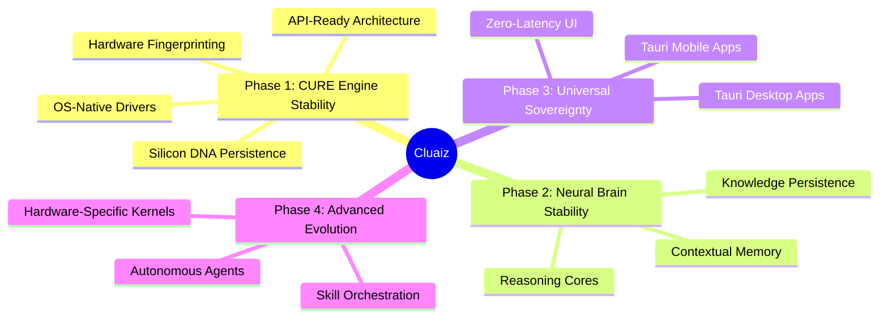

# 🛰️ CLUAIZ: THE UNIVERSAL NEURAL ROADMAP

Cluaiz is engineered to be a **Universal Sovereign Kernel**. Our roadmap is a surgical strike towards hardware-agnostic, high-performance neural execution.

---

## 🏛️ PHASE 1: CURE ENGINE STABILITY (The Great Linkage)
**Goal**: Transform the core engine into an industrial-grade, API-ready infrastructure.

- [x] **Silicon Discovery**: Deep probing of CPU/GPU/NPU (NVIDIA, Apple Silicon, etc.).
- [x] **Hardware Fingerprinting**: Atomic persistence of hardware state in `system_control.json`.
- [ ] **API Standardization**: Expose the engine via a high-performance Rust/REST API for third-party integrations.
- [ ] **Unified Loader**: Zero-latency model loading across Llama, Candle, and BitNet backends.
- [ ] **Silicon DNA**: Refine the hardware-to-engine mapping for "Makkhan" (smooth) performance.
-  CORE FOUNDATION
✅ CLI
✅ Engine
✅ Kernel
✅ Drivers
✅ Model runtime

## 🧠 PHASE 2: BRAIN STABILITY (Neural Continuity)
**Goal**: Establish a permanent memory layer that allows the OS to "remember" and "reason".

- [ ] **Knowledge Graph**: Integrate decentralized storage for persistent model context.
- [ ] **Neural Stitching**: Perfect the `SovereignSignal` injection for session continuity.
- [ ] **Context Compression**: High-efficiency KV-cache management.

## 📱 PHASE 3: UNIVERSAL SOVEREIGNTY (Cross-Platform Apps)
**Goal**: Bring Cluaiz to every device with a premium, zero-latency interface.

- [ ] **Tauri Desktop Core**: High-performance Windows, Linux, and macOS applications.
- [ ] **Tauri Mobile Bridge**: Native-speed inference on iOS and Android.
- [ ] **Aesthetic Mastery**: Implementing the "Sovereign UI" design system (Glassmorphism + Dark Mode).

## ⚡ PHASE 4: ADVANCED EVOLUTION (The Skill Era)
**Goal**: Beyond chat—true autonomous capability.

- [ ] **Skill Orchestration**: A modular system for the OS to perform real-world tasks (coding, browsing, automation).
- [ ] **Multi-Agent Swarm**: Coordination between multiple local models.
- [ ] **Kernel Optimization**: Hand-optimized Assembly/C++ kernels for edge devices (Raspberry Pi, Mobile NPU).

---

> "Sovereignty is not just about running a model; it's about owning the entire stack from Silicon to UI." 🦾
