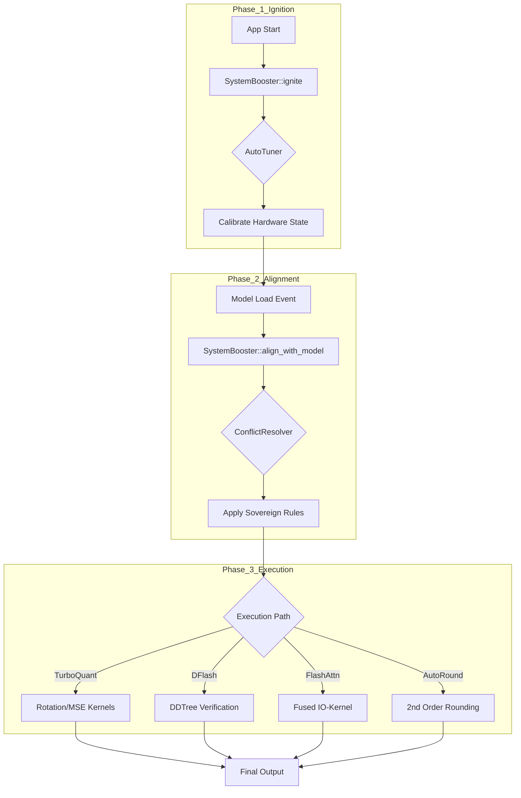

# System Booster: The Neural Accelerator

The **System Booster** is the central nervous system of Cluaiz-OS optimization. It is an industrial-grade bare-metal isolator designed to extract every bit of performance from silicon while maintaining 100% mathematical integrity.

---

## 🏛️ Phase-Level Architecture (The Deep Map)

### 1. 🏛️ `manager/`: The Neural Sovereign (Governance Layer)
This is the "Brain" that decides the fate of every optimization.
*   **`mod.rs`**: Central gateway. Orchestrates communication between sub-managers.
*   **`conflict_resolver.rs` (⚖️)**: The **Logical Arbiter**. Ensures incompatible features (DFlash + Low VRAM) don't crash the GPU.
*   **`auto_tuner.rs` (🧪)**: The **Silicon Sniper**. Calibrates `Auto` states based on hardware (NVIDIA/Apple/Qualcomm).
*   **`dependency_graph.rs` (🔗)**: Maps feature dependencies (e.g., Speculative Decoding needs valid DraftModels).
*   **`priority_scheduler.rs` (🚦)**: Manages compute budgets for TTT vs. Real-time generation.

### 2. ⚡ `dflash/`: Speculative Decoupling (Lucebox Integration)
*   **`engine.rs`**: Orchestrates the Block-Diffusion verification pass.
*   **`kv_cache.rs`**: Manages **Asymmetric KV Stitching** (K=TQ3_0, V=F16).
*   **`ddtree.rs`**: Implements the **DDTree Algorithm** for multi-token validation.

### 3. 💎 `turbo_quant/`: Precision Mastery (Compression Engine)
*   **`mse.rs`**: Mean-Squared-Error optimization for weight fitting.
*   **`polar.rs`**: Polar-Coordinate adjustment for 2nd-order weight correction.
*   **`rotation.rs`**: Hadamard/Givens rotation matrices for feature decorrelation.
*   **`qjl.rs`**: Quantized Johnson-Lindenstrauss projections for extreme dimensionality reduction.
*   **`simd_probes.rs`**: Hardware-native SIMD (AVX512/AMX) acceleration kernels.

### 4. 🧠 `neural_core/`: Research Fusion
*   **`kernel_fusion.rs`**: Fuses multiple layers into a single hardware kernel to reduce memory trips.

### 5. 🌊 `flash_attn/` & `auto_round/`: Hardware Optimizers
*   **`flash_attn/mod.rs`**: IO-aware attention implementation (Sliding Window, Paged).
*   **`auto_round/mod.rs`**: 2nd-order weight rounding for 3-bit/4-bit accuracy.

### 6. 🛰️ `telemetry/` & `os_tuning/`: Environmental Control
*   **`telemetry/distortion.rs`**: Tracks signal-to-noise ratio during quantization.
*   **`os_tuning/mod.rs`**: Adjusts OS-level process priorities and HugePages.

---

## 🌊 Logic & Data Flow (The Neural Mind-Map)

---

## ⚖️ Sovereign Conflict Matrix (The Manager's Code of Law)

| Optimization | Dependent On | Conflict Action | Technical Rationale |
| :--- | :--- | :--- | :--- |
| **DFlash (Speculative)** | VRAM > 12GB | **Force TurboQuant = ON** | Speculative overhead is ~2GB; TQ compression prevents OOM. |
| **BitNet / SSM Models** | Native Weights | **Force DFlash = OFF** | Linear recurrence speed beats speculative verification overhead. |
| **Flash Attention** | Tensor Cores | **Force Auto-Fallback** | Uses CPU fallback if specialized hardware is missing. |
| **Auto-Round** | MSE Weights | **Force TurboQuant = ON** | Needs Polar-rotation buffers for optimal weight correction. |
| **OS Tuning** | Sudo/Admin | **Warn & Bypass** | Critical for HugePages, but system remains sovereign without it. |

---

## 🛠️ Scale Guide: Adding a New "Hyper-Engine"
1.  **Isolation**: Create a dedicated folder in `src/hyper_engine/`. 
2.  **Kernel Link**: Implement raw logic (CUDA/Rust) in your folder.
3.  **Governance**: Add rules to `manager/conflict_resolver.rs` to define its interaction with existing boosters.
4.  **Sovereign Entry**: Add detection logic in `manager/auto_tuner.rs` for hardware-native support.

 