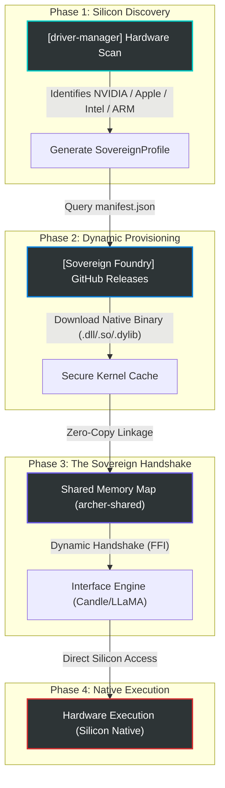

# 🛰️ Cluaiz-OS: Sovereign Inference Drivers (SID)

## 🏛️ **Architecture Overview: The Hardware Abstraction Layer (HAL)**
The `inference-drivers` module is the **"Silicon Heart"** of Cluaiz-OS. It serves as a unified Hardware Abstraction Layer (HAL) that bridges our high-level Neural Kernels (`Candle`, `LLaMA`, `BitNet`) with the raw physical silicon (NPU, GPU, TPU, CPU).

Our philosophy is **"Universal Sovereignty"**: The same Cluaiz instance must be able to run on any OS and any hardware with zero performance penalty.

---

## 🧠 **The Driver-Kernel Handshake**

### **1. Universal Execution Providers**
Our Kernels are designed to be "Hardware-Agnostic" at the source level but "Hardware-Native" at the execution level. 
- **Candle Engine:** Natively interfaces with our `cuda`, `metal`, and `vulkan` drivers via its internal JIT/AOT math kernels.
- **LLaMA (llama.cpp) Engine:** Seamlessly switches between `OpenVINO`, `QNN`, `ROCm`, and `Metal` by dynamically linking the corresponding driver bridge from this directory.
- **BitNet / Mamba:** Specialized kernels that utilize our `cpu-blas` and `ghost` drivers for high-efficiency integer math.

### **2. Zero-Copy Memory Pointers**
The `driver-manager` utilizes `archer-shared` to create a **Zero-Copy Memory Map**. When a driver (e.g., `cuda/v12.1`) is loaded, it shares the exact same memory address space with the Inference Engine. This eliminates the "Data Copy Penalty" that plagues traditional AI frameworks.

---

## 📂 **The Sovereign Driver Matrix**

| Hardware Driver | Support Parity | Optimization Target |
| :--- | :--- | :--- |
| **CUDA** | Windows / Linux | NVIDIA RTX / Tesla (v11.8 & v12.1) |
| **Metal** | macOS / iOS / Darwin | Apple Silicon (M1/M2/M3/M4) |
| **OpenVINO** | Windows / Linux | Intel Core Ultra NPUs & Iris Xe GPUs |
| **QNN** | Windows / Android | Qualcomm Snapdragon X Elite / Mobile |
| **Vulkan** | Win / Linux / Android / macOS | Universal GPU Fallback (MoltenVK on Mac) |
| **ROCm** | Windows / Linux | AMD Radeon / Instinct Series |
| **CPU-BLAS** | ALL Operating Systems | Universal Legacy/Edge CPU Math |
| **Ghost** | Virtualized / Mock | Mock-Silicon for Testing & Privacy-First Execution |

---

## 🚦 **Industrial versioning (Why v11.8 vs v12.1?)**
Unlike other systems that assume the user has the latest setup, Cluaiz-OS is designed for the real world.
- **Legacy Support:** Older NVIDIA GPUs (Pascal/Turing) often require `v11.8` for stability.
- **Modern Mastery:** Newer 40-series and 50-series GPUs utilize `v12.1+` for maximum compute throughput.
The `SovereignLinker` automatically detects the hardware generation and provisions the correct versioned binary from the cloud foundry.

---

## 🛠️ **Installation & Linking**
Drivers are not "installed" in the traditional sense; they are **"Provisioned"**.
1. `driver-manager` scans the hardware.
2. It fetches the signed binary from the [Sovereign Foundry Matrix](https://github.com/cluaiz/cluaiz/releases/tag/latest-kernels).
3. It validates the SHA-256 hash via the `kernel-manifest.json`.
4. It performs a **Dynamic Handshake** using the `archer_kernel_init` symbol to attach the driver to the engine's memory.

---

## 🗺️ **Sovereign Logic Flow: The Silicon-to-Kernel Lifecycle**

**"Silicon Agnostic. Native Performance. Universal Sovereignty."**
 