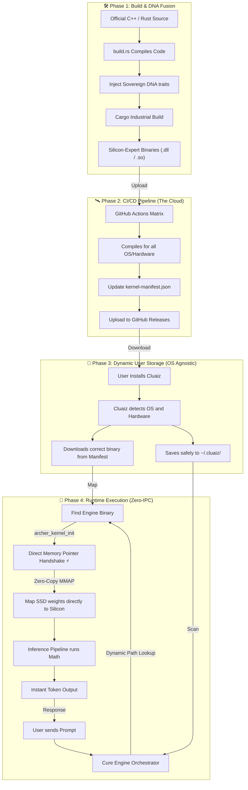

# Cluaiz Interface Engines (The Foundry)
**The Neural Interface-engines: From Source to Silicon Intelligence**

## 🎯 1. THE GOAL: WHY CLUAIZ?

To understand Cluaiz, we must first understand the problem with current AI systems. 

**The Problem: The "Wrapper" Tax**
Most popular AI systems today (like Ollama or vLLM) operate as "Wrappers". They use Python, Docker, or REST APIs (like HTTP/JSON) to send data back and forth between the user interface and the AI engine. Every time data moves through these layers, the computer has to translate it (Serialization/IPC). This creates a massive bottleneck. We call this the "Efficiency Tax".

**The Cluaiz Solution: The Sovereign Engine**
Our absolute goal is to eliminate this tax. Cluaiz does not use HTTP APIs or Python to talk to the AI engine. Instead, it builds a **Neural Interface-engine**. 
This means the Cluaiz Orchestrator and the AI Engine run inside the **exact same memory space**. It establishes a "direct handshake" with the silicon (CPU/GPU). Because there is zero translation and zero communication overhead, Cluaiz achieves maximum possible speed and runs natively on any OS (Android, Mac, Windows, Linux).

---

## 🧬 2. THE "DNA": HANDSHAKE & PROTOCOL

If we want different AI engines (like Llama, BitNet, or Mamba) to plug into Cluaiz seamlessly, they all need a unified architecture. We call this the "Sovereign DNA."

### **A. `archer_shared` (The Sovereign Dictionary)**
*   **The Analogy**: Imagine Cluaiz-OS is a **Space Station** and a new AI engine is an external **Robot**. For the robot to work on the station, both must speak the exact same language.
*   **What is it?**: `archer_shared` is a central Rust dictionary (crate) that defines this common language.
*   **How it works**: It contains strict rules (called `Traits` in Rust) such as `generate()`, `load_model()`, and `unload()`. Whenever we build a new engine, we link it to `archer_shared`. This ensures the engine knows exactly what commands the Cluaiz Orchestrator will send it.

### **B. `archer_kernel_init` (The Sovereign Handshake)**
*   **The Analogy**: This is the engine's "Identity Card" and "Secret Entrance."
*   **What is it?**: It is a single, specialized function exported inside every compiled engine file (`.dll` on Windows, `.so` on Linux).
*   **How it works**: When Cluaiz needs to load an engine, it doesn't launch a separate program. Instead, it maps the engine's file directly into its own memory and searches for the `archer_kernel_init` symbol.
*   **The Result**: Once found, a direct memory pointer is created. The engine is instantly activated without any heavy API calls. This is the **Zero-IPC Handshake**.

---

## 📂 3. FOLDER ARCHITECTURE & FILE MISSION

Every file has a specific neural purpose:

```text
interface-engines
├── 📁 dispatcher/             # 🚦 Multi-Engine Task Router
│   ├── 📁 src/
│   │   └── 🦀 lib.rs          # 🔀 Routes prompts to the active native/llama backend
│   └── ⚙️ Cargo.toml          # 📦 Dispatcher manifest
├── 📁 ffi/                    # 🌉 Global Foreign Function Gateway
│   ├── 📁 src/
│   │   └── 🦀 lib.rs          # 🛡️ Global C-ABI export surface for Cluaiz-UI
│   └── ⚙️ Cargo.toml          # 📦 FFI manifest
├── 📁 global_runtime/         # 🌍 Background Async Engine
│   ├── 📁 src/
│   │   └── 🦀 lib.rs          # ⏳ Tokio async orchestrator for streaming inferences
│   └── ⚙️ Cargo.toml          # 📦 Global runtime manifest
├── 📁 llama /          # ⚡ The GGUF / DFlash Speedster
│   ├── 📁 src/
│   │   ├── 📁 ffi/
│   │   │   ├── 🦀 lucebox.rs  # 🌉 Safe C++ bindings (DDTree & SSM Convolutions)
│   │   │   └── 🦀 mod.rs      # 📦 FFI module registration
│   │   ├── 🦀 asm_kernels.rs  # 🔥 Hand-written Assembly for AVX-512/AMX
│   │   ├── 🦀 bridge.rs       # 🔗 Dynamic Linker (OS Agnostic, No hardcoded C:\)
│   │   ├── 🦀 config.rs       # ⚙️ Hyper-params (Context length, layers)
│   │   ├── 🦀 lib.rs          # 🤝 Entry Point: C-ABI Handshake gateway
│   │   ├── 🦀 loader.rs       # 🚚 SSD-to-Silicon zero-copy mapping
│   │   ├── 🦀 pipeline.rs     # 🔄 Token generation and prefill loop
│   │   └── 🦀 router.rs       # 🚦 Dynamically picks CUDA/Metal/Vulkan
│   ├── ⚙️ Cargo.toml          # 📦 Llama backend manifest
│   └── 🦀 build.rs            # 🛠️ Clones/Compiles upstream C++ kernels
├── 📁 candle /         # 🔩 The Universal Engine (Candle)
│   ├── 📁 src/
│   │   ├── 🦀 bit_linear.rs   # 🧱 Ternary math (-1, 0, 1) for 1.58b/1.0b models
│   │   ├── 🦀 bitmamba.rs     # 🐍 Pure-Rust Euler-discretized Mamba-4 logic
│   │   ├── 🦀 config.rs       # ⚙️ Architecture definitions
│   │   ├── 🦀 infer.rs        # ⚡ Main execution loop for Rust native models
│   │   ├── 🦀 lib.rs          # 🤝 Sovereign Handshake (archer_kernel_init)
│   │   └── 🦀 loader.rs       # 🚚 Native weight loader logic
│   ├── ⚙️ Cargo.toml          # 📦 Native backend manifest
│   └── 🦀 build.rs            # 🛠️ Builds native execution environments
├── 📁 neural_core/            # 🧠 The Research & Math Layer
│   ├── 📁 src/
│   │   ├── 📁 fine_tuning/    # 🔧 Backprop and parameter scaling
│   │   │   ├── 🦀 dpo_trainer.rs   # 🎯 Direct Preference Optimization loop
│   │   │   ├── 🦀 lora_adapter.rs  # 🔗 Low-Rank Adaptation logic
│   │   │   └── 🦀 mod.rs           # 📦 Fine-tuning module registration
│   │   ├── 📁 interfaces/     # 📖 Contracts for engine communication
│   │   │   ├── 🦀 engine_contract.rs # 🤝 Sovereign execution traits
│   │   │   ├── 🦀 memory_contract.rs # 🧠 Cross-engine memory definitions
│   │   │   └── 🦀 mod.rs           # 📦 Interfaces module registration
│   │   ├── 📁 memory_ops/     # 🧠 Hardware-agnostic memory management
│   │   │   ├── 🦀 mod.rs           # 📦 Memory ops module registration
│   │   │   ├── 🦀 rope_alignment.rs  # 📐 Rotary Position Embeddings math
│   │   │   └── 🦀 zero_copy_vault.rs # 💾 Memory-mapped structures for SSD loading
│   │   ├── 📁 optimizers/     # ⚙️ Feature logic (TQ, FlashAttn)
│   │   │   ├── 🦀 asymmetric_quant.rs # ⚖️ Mixed precision (K=TQ3_0, V=F16)
│   │   │   ├── 🦀 auto_round.rs    # 🔄 2nd-order weight rounding
│   │   │   ├── 🦀 block_diffusion.rs # ⚡ Multi-token generation logic
│   │   │   ├── 🦀 flash_attention.rs # 🌊 IO-aware paged attention
│   │   │   ├── 🦀 mod.rs           # 📦 Optimizers module registration
│   │   │   └── 🦀 speculative_decoding.rs # 🤔 Draft model verification logic
│   │   ├── 📁 state_steering/ # 🔬 Advanced State Steering
│   │   │   ├── 🦀 jepa_encoder.rs
│   │   │   ├── 🦀 kv_steering.rs         # ⚡ Direct SSD-to-VRAM KV Injection (mmap)
│   │   │   ├── 🦀 liquid_state.rs        # 🌊 Liquid AI ODE time-constants
│   │   │   ├── 🦀 mod.rs
│   │   │   ├── 🦀 test_time_training.rs  # 🔄 Dynamic gradient updates (TTT)
│   │   └── 🦀 lib.rs            # 📖 Shared Memory layout & Traits
│   └── ⚙️ Cargo.toml
│
├── 🚦 dispatcher/ (Multi-Engine Task Router)
│   ├── 📁 src/
│   │   └── 🦀 lib.rs            # 🔀 Routes prompt to the active native/llama backend
│   └── ⚙️ Cargo.toml
│
├── 🌉 ffi/ (Global Foreign Function Gateway)
│   ├── 📁 src/
│   │   └── 🦀 lib.rs            # 🛡️ Global C-ABI export surface for Cluaiz-UI
│   └── ⚙️ Cargo.toml
│
├── 🌍 global_runtime/ (Background Async Engine)
│   ├── 📁 src/
│   │   └── 🦀 lib.rs            # ⏳ Tokio async orchestrator for streaming inferences
│   └── ⚙️ Cargo.toml
│
├── 🛠️ utils/ (Sovereign Helpers)
│   ├── 📁 src/
│   │   └── 🦀 lib.rs            # 🔧 OS-Agnostic pathing and utility tools
│   └── ⚙️ Cargo.toml
│
└── ⚙️ Cargo.toml (Workspace Root)
```

---

## 🏗️ 4. STRATEGY B: THE "FOUNDRY" FUSION (OFFICIAL CODE + DNA)

We don't need to reinvent the wheel for every mathematical operation. Instead, we take the world's best, highly-optimized open-source kernels (like `llama.cpp` for GGUF or `BitNet` logic) and **fuse** them with our Sovereign architecture.

Here is the step-by-step fusion process:

1.  **Pulling the Raw Power (`build.rs`)**: We link directly to the official upstream repositories. This ensures we always have the latest speed optimizations (like new AVX-512 or Metal instructions) directly from the creators.
2.  **Injecting the DNA (`lib.rs`)**: We write a Rust wrapper around this raw C++/CUDA code. This wrapper translates the raw code into our `archer_shared` language and injects the `archer_kernel_init` "Identity Card".
3.  **The Compilation Fusion**: When we run `cargo build`, the Rust compiler and C++ compiler work together to fuse the upstream code and our DNA into a single, standalone Dynamic Library (`.dll` for Windows, `.so` for Linux).
4.  **The Golden Rule: No Hardcoded Paths**: Our dynamic loaders (like `bridge.rs`) are strictly OS-Agnostic. They **never** rely on static paths like `C:\`. Libraries are loaded dynamically (e.g., checking `ARCHER_PRISM_PATH` or looking relative to the `.exe`). This guarantees that if a user installs Cluaiz on an external SSD or a D:\ drive, the engine will still load flawlessly.

---

## 🛰️ 5. DISTRIBUTION PIPELINE (`inference-kernel.yml`)

We want Cluaiz to feel like magic for the user. They shouldn't have to install C++ compilers or CUDA toolkits. We handle all the heavy lifting in the cloud.

*   **The CI/CD Matrix**: Every time we update an engine, our GitHub Actions pipeline boots up. It simultaneously compiles the engine for Linux, Windows, Mac, Android, and iOS.
*   **The Sovereign Vault**: The resulting expert binaries (`.dll`, `.so`, `.dylib`) are securely uploaded to GitHub Releases.
*   **The Master Map (`kernel-manifest.json`)**: We maintain a JSON file that acts as a treasure map. It links every possible OS and Hardware combination to its specific compiled binary URL.
*   **The User Experience (Silicon Match)**: When a user runs Cluaiz for the first time, the system detects their hardware (e.g., Windows + NVIDIA GPU). It checks the manifest, silently downloads the exact pre-optimized engine for that hardware, and saves it to their dynamic `~/.cluaiz` folder. The user gets instant, maximum-speed inference with zero setup.

---

## 🗺️ 6. THE UNIFIED SOVEREIGN FLOW (MASTER MAP)

This map shows the entire lifecycle of a Cluaiz Engine—from the moment we write code in the Foundry, to the moment it generates tokens on a user's machine.



---

## 🔬 7. PERFORMANCE MECHANISM (SOVEREIGN REALITY)

How does Cluaiz achieve its extreme speed? By breaking the standard rules of software architecture. Here are the three pillars of our performance:

### **1. 🤝 Zero-IPC Handshake (No Talking, Just Doing)**
*   **The Standard Way**: Most apps use APIs to talk to AI. It’s like sending a letter, waiting for the AI to read it, and waiting for a reply.
*   **The Cluaiz Way**: We use a **Direct Symbol Lookup** (`archer_kernel_init`). Cluaiz directly jumps into the AI's memory space. It’s not sending a letter; it’s sharing a brain. The switch is instantaneous.

### **2. ⚡ Zero-Copy Architecture (Direct from SSD to GPU)**
*   **The Standard Way**: When an AI loads a 10GB model, it copies 10GB from the SSD to the CPU RAM, and then copies it again to the GPU. This takes time and wastes memory.
*   **The Cluaiz Way**: We use **Memory Mapping (mmap)** in our `kv_steering.rs` module. We tell the computer hardware to treat the SSD storage exactly like RAM. We pass raw memory pointers directly to the silicon. **Zero data is duplicated.**

### **3. 🧩 Ternary Math ($1.58$-bit & $1.0$-bit)**
In our `candle `, we use extreme optimization math for specific models (like BitNet).

| Feature          | Standard AI (Llama)         | Ternary BitNet (Cluaiz Native)     |
| ---------------- | --------------------------- | ---------------------------------- |
| **Math Type**    | Multiplication (Very Heavy) | Addition only (Ultra-Light)        |
| **Precision**    | 16-bit or 8-bit floats      | **1.58-bit or 1.0-bit** (-1, 0, 1) |
| **Compute Unit** | Floating Point Processors   | **Sign-Bit Accumulators**          |

*By turning heavy multiplication into simple addition, we can run massive models at lightning speeds entirely on standard CPUs.*