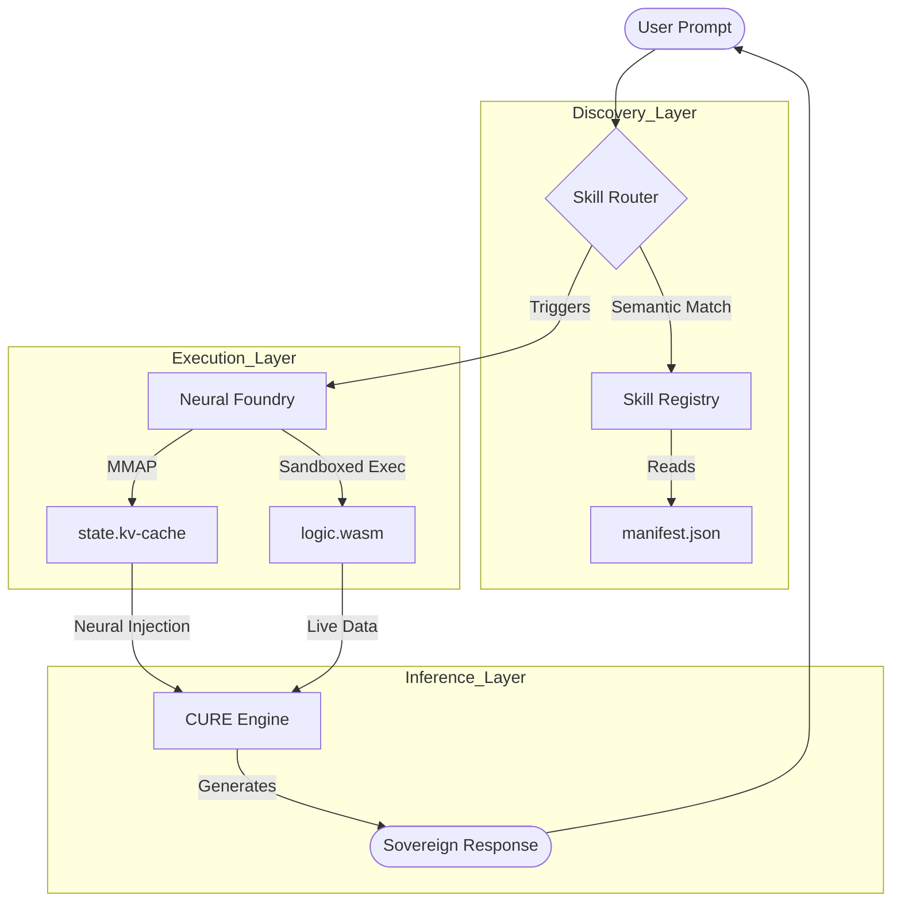

# 🛠️ CLUAIZ-Skills: THE INDUSTRIAL BLUEPRINT (Sovereign Creator)

This manual explains the deep architecture of Cluaiz Skills. For a developer, a skill is not just a plugin; it is a **Neural-Logic Hybrid** that extends the model's capabilities on-the-fly.

---

## 🏗️ 1. THE DEEP EXAMPLE: "HomeManager Pro"
Let's build a skill that allows Cluaiz to manage a smart home via local APIs and neural reasoning.

### A. The Intent Map (`manifest.json`)
The manifest tells the **Neural Router** to look for home-related patterns.

```json
{
    "id": "cluaiz.skill.home_manager",
    "name": "HomeManager Pro",
    "version": "2.1.0",
    "description": "Enterprise-grade home automation with neural scene understanding.",
    "triggers": {
        "semantic": ["light", "ac", "security", "temperature", "gate", "camera"],
        "entropy_threshold": 0.35
    },
    "permissions": {
        "level": "ReadOnly",
        "network": true, 
        "filesystem": false
    },
    "soul_type": "KV_CACHE"
}
```

### B. The Logic Execution (`logic.wasm`)
This is the "Hands" of the skill. Written in Rust and compiled to WASM.

**Conceptual Rust Code:**
```rust
#[no_mangle]
pub fn run(prompt: String) -> String {
    if prompt.contains("ac") && prompt.contains("on") {
        // Direct binary call to local IoT Gateway
        let status = iot_gateway::set_ac_temp(22); 
        return format!("Neural Handshake Complete: AC is now set to 22°C. [Status: {}]", status);
    }
    "Logic: Intent not actionable by WASM.".to_string()
}
```
**Why this is Deep:** In Cluaiz, WASM logic can interact with the host system's hardware (via declared permissions) while keeping the user's files 100% safe in a sandbox.

### C. The Neural Soul (`state.kv-cache`)
This is the "Brain" of the skill. It contains the KV-tensors that teach the model **how to talk about a home.**
- **Without KV-Cache**: AI might say "I turned on the light."
- **With KV-Cache**: AI says "The living room ambiance is now optimized for movie night. All lights dimmed to 20%."

### D. The External Connectivity (`connector.mcp`)
This is the "Hands" of the skill. It uses the **Model Context Protocol** to talk to external systems.

**Example `connector.mcp`:**
```json
{
    "mcp_id": "home_assistant_bridge",
    "endpoint": "http://192.168.1.100:8123/api/mcp",
    "auth": {
        "type": "Bearer",
        "env_var": "HOME_ASSISTANT_TOKEN"
    },
    "tools": [
        {
            "name": "get_security_status",
            "description": "Checks the state of all alarm sensors."
        },
        {
            "name": "lock_all_doors",
            "description": "Sends a global lock command to the home bridge."
        }
    ]
}
```
**Why this is Deep:** WASM (Step B) handles the **Local/Fast** logic, but MCP (Step D) allows Cluaiz to talk to **Universal Systems** (like Home Assistant or Google Home) using a standardized JSON-RPC protocol.

---

## 🧠 2. THE EXECUTION LIFECYCLE (How it actually works)

1. **PROMPT ARRIVAL**: User types "Is my front gate locked?"
2. **INTENT DISCOVERY**: The `SkillRouter` scans all `manifest.json` files. It sees "gate" in HomeManager.
3. **NEURAL STITCHING**: The `KVStitcher` mmap's `state.kv-cache`. It **injects** these pre-computed memories into the model's VRAM.
4. **LOGIC & CONNECTIVITY**: 
    - **WASM**: The system calls `logic.wasm` for local/binary processing.
    - **MCP**: The `McpGateway` calls the external bridge (e.g., Home Assistant) via `connector.mcp`.
5. **GENERATION**: The LLM, now "augmented" by the injected memory, the local WASM result, and the live MCP data, provides a sovereign response.

---

## 🗺️ 3. SYSTEM MIND MAP (The Sovereign Flow)



---

## 🛡️ 4. DEVELOPER FAQ
**Q: Can I create a skill that uses my own API?**
A: Yes. Just set `"network": true` in the manifest and call your API inside your WASM code.

**Q: Do I need to retrain the model?**
A: **Never.** That's the power of KV-Stitching. You provide the pre-computed state, and we inject it at runtime.

**Q: Is it safe?**
A: 100%. If a skill tries to access a file without permission, the **PermissionGuard** kills the process instantly.

---
 