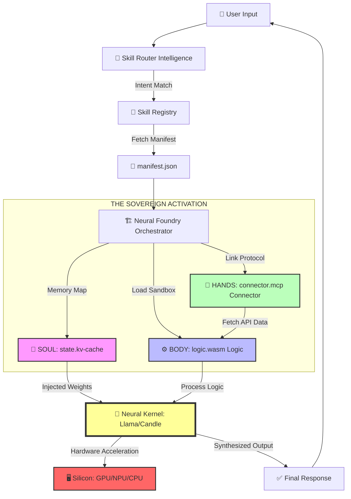

Welcome to the **Neural Foundry**. This directory houses the modular intelligence of Cluaiz-OS. Unlike traditional "plugins" or "tools," Cluaiz Skills are hardware-native, neural-injected expansions that allow the AI to learn new capabilities without retraining.

> [!IMPORTANT]
> **New to Skills?** Read the [Deep Industrial Blueprint](./Custom-Skill-Blueprint.md) for a step-by-step guide on building your first HomeManager skill.

---

## 🛰️ THE ARCHITECTURE: SOUL, BODY, & HANDS

Every skill in Cluaiz-OS follows the **Triple-Tier Sovereign Architecture**, ensuring high performance, complete isolation, and real-world connectivity.

### 1. 🧠 THE NEURAL STATE (`state.kv-cache`)
- **Type**: Binary Neural Tensors (KV-Cache / Steering Vectors).
- **Role**: This is the "Pre-computed Knowledge" of the skill. When a skill is activated, these tensors are memory-mapped (`mmap`) directly into the model's forward pass.
- **Benefit**: **Zero Token Tax**. The AI "knows" how to use the skill without reading long system prompts.

### 2. ⚙️ THE BODY (`logic.wasm`)
- **Type**: Compiled WebAssembly Binary.
- **Role**: High-performance, sandboxed logic. If a skill needs to calculate something, parse a file, or run an algorithm, it happens here.
- **Benefit**: **Hardware-Native Speed**. Runs at near-C++ speeds while being 100% isolated from your host OS.

### 3. 🤝 THE HANDS (`connector.mcp`)
- **Type**: Model Context Protocol (JSON-RPC) Config.
- **Role**: Real-world connectivity. This connects the AI to external APIs (GitHub, Google Mail, Slack) or local databases.
- **Benefit**: **Universal Compatibility**. Uses the industry-standard MCP to talk to any service.

### 4. 🛂 THE PASSPORT (`manifest.json`)
- **Type**: Metadata & Permission Schema.
- **Role**: Defines the skill's identity, semantic triggers, and security boundaries.

---

## 🚦 THE SOVEREIGN LIFECYCLE

How does a skill go from a folder to an active capability?

1.  **Discovery**: The `NeuralFoundry` Registry scans this directory and indexes every `manifest.json`.
2.  **Intent Routing**: The `SkillRouter` matches user input against the semantic triggers defined in the manifests.
3.  **Activation**:
    - **Neural Stitching**: The `state.kv-cache` tensors are mmapped.
    - **Logic Loading**: The `.wasm` engine is spun up in a sandbox.
4.  **Execution**: The AI performs the task, guarded by the `PermissionGuard`.

---

## 🛡️ SECURITY & PRIVACY (ZERO-TRUST)

- **Isolated Execution**: No skill can access your files or network unless explicitly granted permission in its `manifest.json`.
- **WASM Sandboxing**: Skill logic cannot "escape" the Wasmtime runtime.
- **Audit Logging**: Every action taken by a skill is logged in the `sovereign-ops/audit` layer.

---

## 🛠️ SKILL CATEGORIES

| Category | Purpose | Example |
| :--- | :--- | :--- |
| `core-intelligence` | Self-improvement & Evaluation | `skill-creator` |
| `communication` | Messaging & Email | `whatsapp-native` |
| `dev-suite` | Coding & DevOps | `github-manager` |
| `data-science` | Analytics & SQL | `duckdb-expert` |
| `sovereign-ops` | Hardware & Security | `vram-arbiter` |

---

## ✍️ THE SOVEREIGN CREATOR FLOW

To build and deploy a skill, follow the **Triple-Step Handshake**:

1. **DESIGN THE MANIFEST**: Define your semantic triggers (e.g., `["light", "fan"]`) in `manifest.json`.
2. **COMPILE THE LOGIC**: Write your deterministic logic in Rust and compile to `logic.wasm`. This allows the AI to "act" in the real world.
3. **PRE-COMPUTE THE SOUL**: Generate a `.kv-cache` to teach the AI the "Domain Language" of your skill.

Cluaiz-OS performs a **Hot-Swap Discovery**: Just drop the folder here, and the system identifies it in <10ms without a restart.

---

**"Sovereignty is not given; it is built into the architecture."**
