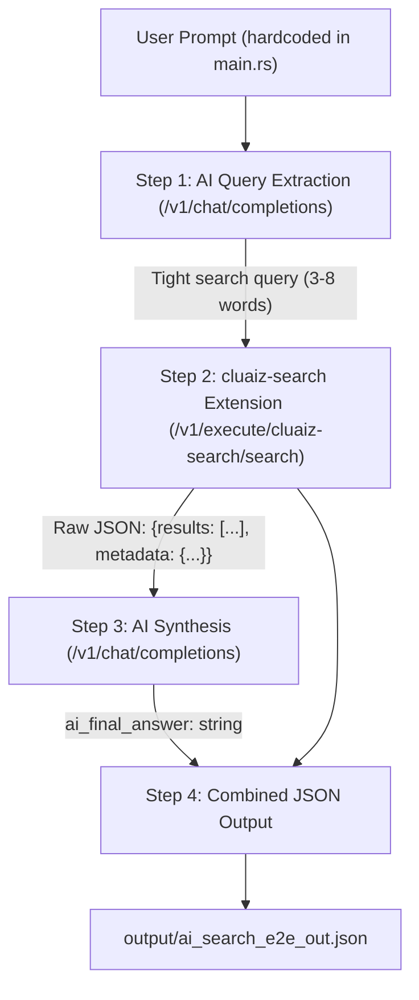

# Component: ai_search_e2e_test

## Technical Specification
- **Purpose:** Full end-to-end test that verifies the complete AI ↔ `cluaiz-search` pipeline: a raw user prompt flows through the AI for query extraction, the `cluaiz-search` extension performs a live web search, and the AI synthesizes a final answer from the results. Both the extension's raw output and the AI's final response are captured in a single JSON file.
- **Platform Support:** Windows, Linux, macOS
- **Reusability Level:** Test Utility (not part of production build)

## Architectural Flow


## Output Schema (`ai_search_e2e_out.json`)
```json
{
  "test_metadata": {
    "test_name": "ai_search_e2e_test",
    "user_prompt": "...",
    "derived_search_query": "...",
    "total_execution_time_sec": 4.23,
    "stages": {
      "query_extraction_sec": 0.8,
      "search_extension_sec": 1.2,
      "ai_synthesis_sec": 2.1
    }
  },
  "extension_output": {
    "search_query": "...",
    "raw_results": { "status": "success", "metadata": {...}, "results": [...] }
  },
  "ai_output": {
    "model": "default",
    "system_prompt": "...",
    "user_message": "...",
    "final_answer": "...",
    "raw_chat_response": { "choices": [...], "usage": {...} }
  }
}
```

## Deep File Breakdown
- `src/main.rs`:
  - **Logic:** Orchestrates the 4-stage E2E pipeline.
  - **Flow:** Engine health check → `extract_search_query()` → `run_search_extension()` → `synthesize_answer()` → write JSON.
  - **Why:** Separating each stage into its own async function makes individual failure points easy to diagnose.

- `src/main.rs → extract_search_query()`:
  - **Logic:** Asks the AI to condense the user prompt into a 3-8 word search query.
  - **Flow:** Calls `/v1/chat/completions` with a strict system prompt; falls back to the raw user prompt if AI response is malformed or empty.
  - **Why:** Ensures the extension receives a tight, precise query instead of a full natural-language sentence.

- `src/main.rs → run_search_extension()`:
  - **Logic:** Calls the Engine's `/v1/execute/cluaiz-search/search` endpoint.
  - **Flow:** Sends `params.action = "query"` and `params.target = <derived_query>`. Handles both `{ "result": "..json-string.." }` and direct `{ "results": [...] }` response shapes.
  - **Why:** Defensive parsing of both response shapes guards against Engine version differences.

- `src/main.rs → synthesize_answer()`:
  - **Logic:** Builds a human-readable text block from search result snippets and passes it to the AI for a final synthesized answer.
  - **Flow:** Truncates each snippet to 600 chars to prevent context-window overflow; returns all raw AI fields (`raw_chat_response`, `system_prompt_used`, `user_message_sent`) for auditability.
  - **Why:** Full auditability of what the AI was told and what it answered is required for debugging incorrect outputs.

## Failure & Recovery Logic
- **Potential Failure Point:** Engine is not running.
- **Recovery Logic:** Step 0 performs a `/health` check; if it fails, the test exits cleanly with a message instead of panicking.
- **Potential Failure Point:** AI returns a malformed query extraction (too long / empty).
- **Recovery Logic:** `extract_search_query()` falls back to the raw user prompt string if the AI's response doesn't pass validation.
- **Potential Failure Point:** Extension returns an unexpected JSON shape (e.g., `{ "result": "...json-string..." }` wrapper).
- **Recovery Logic:** `run_search_extension()` attempts to parse the inner string as JSON; if that fails, wraps it as `{ "raw_result": "..." }` so the test never panics.

## How to Run
```bash
# From the cluaiz workspace root
cargo run -p ai_search_e2e_test
```
Engine must be running: `cargo run --bin cluaiz serve`
