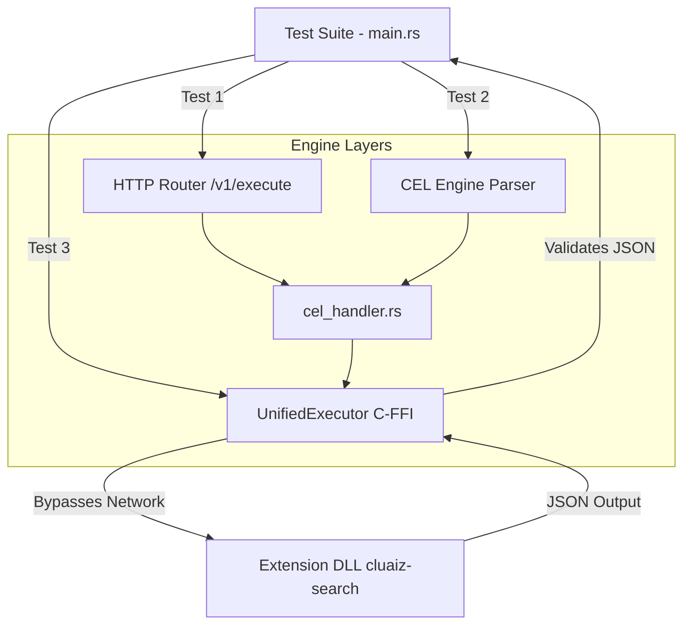

# Engine CEL Test Suite (3-Way Architecture Validator)

This directory contains the strict 3-way integration test suite to validate the execution of Cluaiz Engine's dynamic pipeline (CEL, HTTP, and FFI) before handing off raw data to the AI model. 

The goal of this test is to ensure **Zero-Payload-Corruption** across the 3 execution layers when fetching JSON from WASM/Native extensions (like `cluaiz-search`).

## 🏗️ Architecture Flow



## 🚀 How to Execute the Test

To run this test suite manually, **you must execute it from the Cluaiz workspace root** so that the `MasterRegistry` can correctly locate the `.cluaiz` config folder.

1. **Start the Cluaiz Engine (Background):**
   Open a terminal in the `cluaiz` root folder and start the engine so that HTTP and CEL endpoints are alive:
   ```bash
   cargo run serve
   ```

2. **Run the Test Suite:**
   Open a second terminal in the `cluaiz` root folder and execute the test explicitly pointing to its manifest:
   ```bash
   cargo run --manifest-path test/engine_cel_test/Cargo.toml
   ```

## 📂 Expected Output

Upon successful execution, the test suite will output `✅ Output is proper JSON search result!` for all 3 layers. 

It will also automatically dump the raw JSON structures directly into the local `output` directory for your manual review:

- **HTTP Output:** `test/engine_cel_test/output/http_test_out.json`
- **CEL Output:** `test/engine_cel_test/output/cel_test_out.json`
- **Native FFI Output:** `test/engine_cel_test/output/ffi_test_out.json`

> [!IMPORTANT]  
> If **Test 3 (FFI)** fails with a registry error, ensure you are running the `cargo run` command exactly as shown above from the workspace root, NOT from inside the `test/engine_cel_test` folder.
